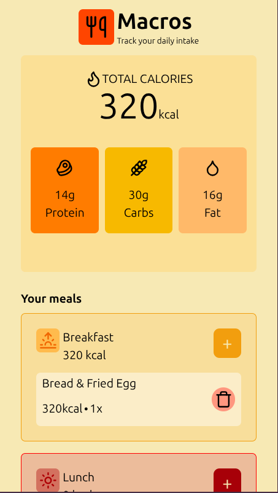
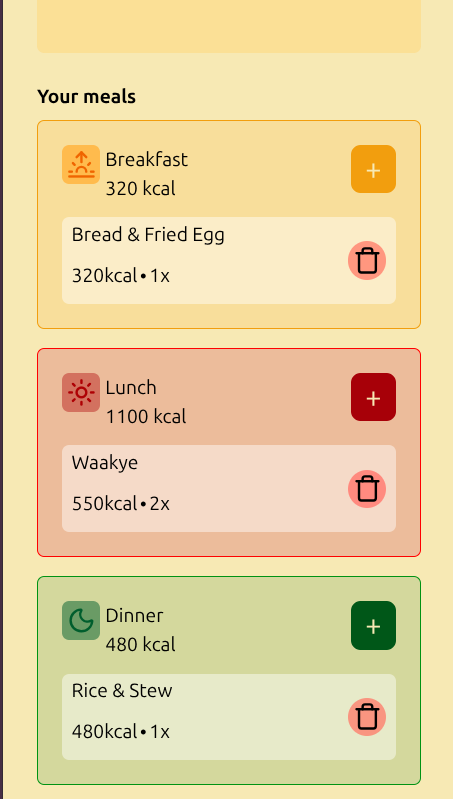
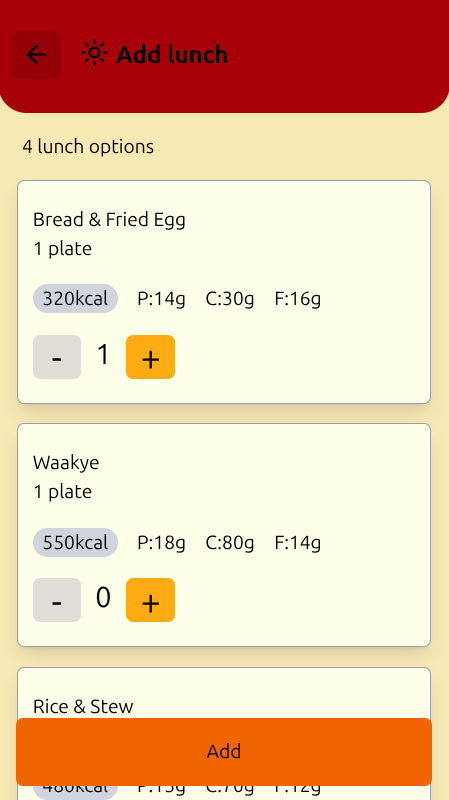

# Macros
**A Ghanaian calorie and macros calculator**

A simple food calorie and macronutrient calculator specifically for Ghanaian meals. 

## Features
- Add meals based on category
- Display calorie count for each meal category
- Display total calories and macros for all meals added

## Built With
- Tailwind
- React
- Vite

## How it works
The total macros and calories of all the meals are summed up and displayed.

## Screenshots

  
   
    

## Future Improvements
- A delete and edit feature
- A calender that saves tracks calorie count per day
- More meal options

Made with 💖 by **Georgina Akumiah**
